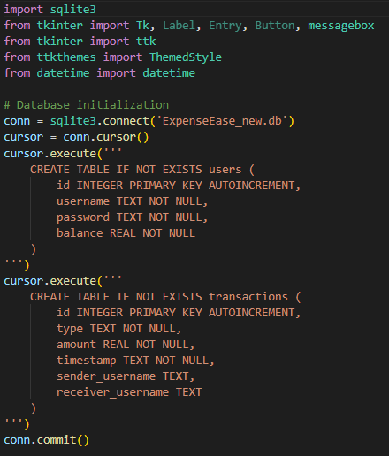
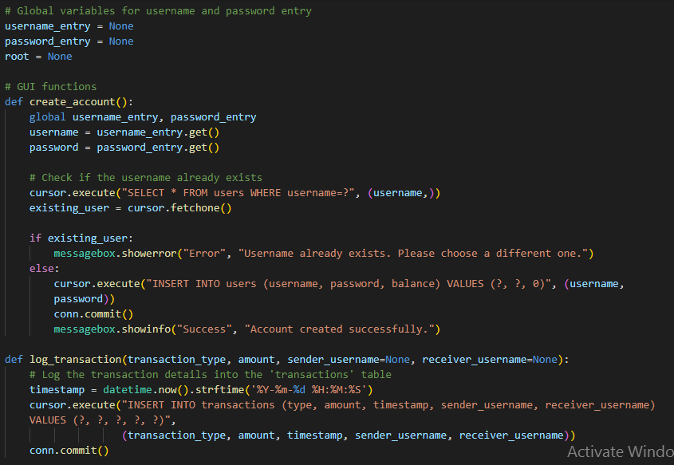
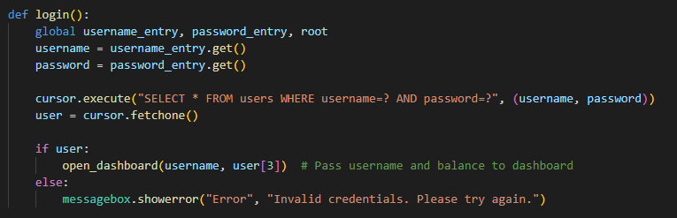
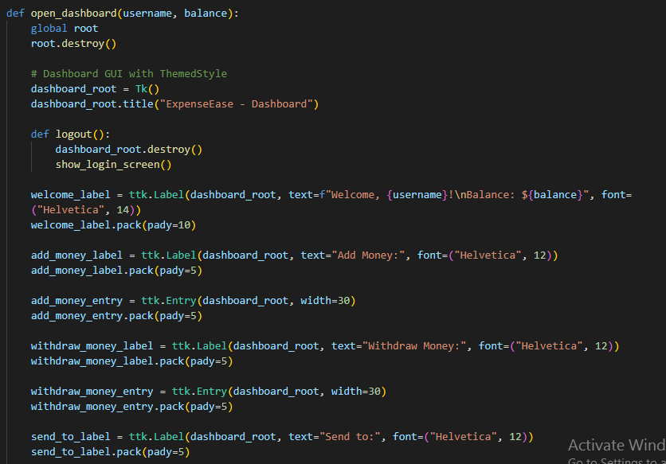
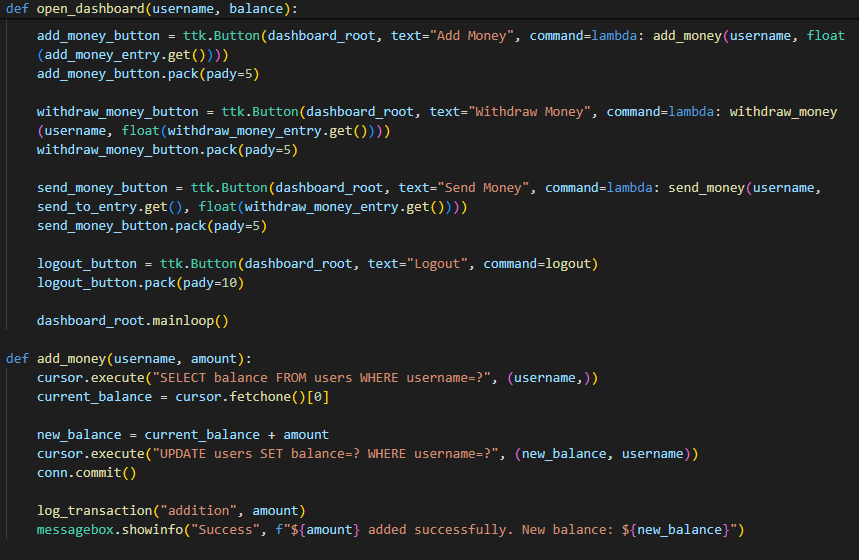
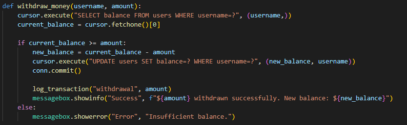
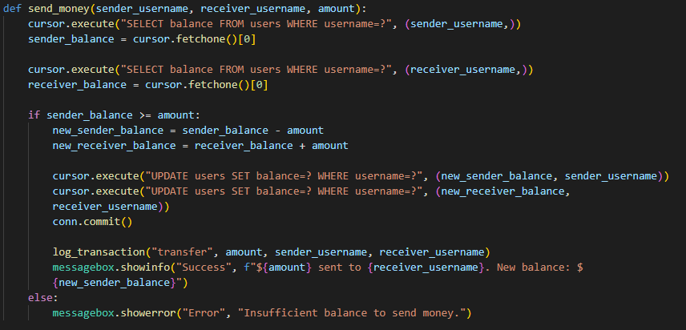
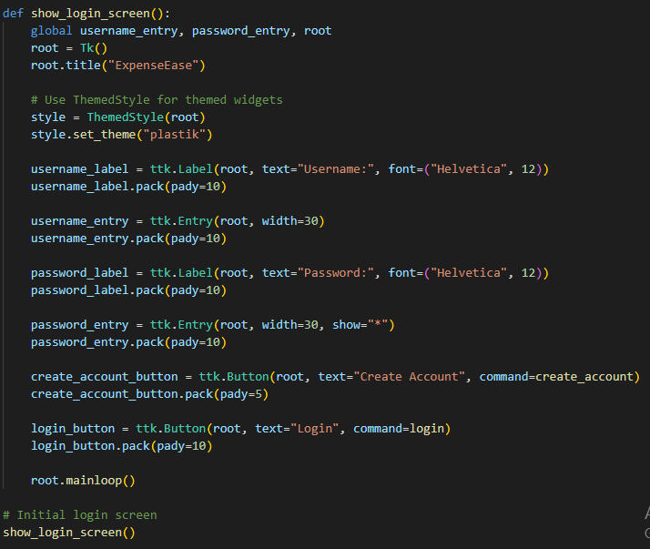

**ExpenseEase Documentation**

ExpenseEase is a personal finance management application that provides users with a simple and intuitive interface for tracking and managing their financial transactions. This document outlines the purpose, functionality, and usage instructions for ExpenseEase.

**Purpose**

ExpenseEase is designed to assist users in managing their personal finances by offering features such as user authentication, transaction logging, and basic financial operations. The application aims to provide a straightforward and efficient way for users to keep track of their expenses, withdrawals, and transfers.

**Functionality**

ExpenseEase includes the following key features:

**User Authentication:**

Users can create accounts with unique usernames and passwords. The application ensures the uniqueness of usernames and provides error messages for existing usernames during account creation.

**Transaction Logging:** 

All financial transactions are recorded in the SQLite database. Transactions include additions, withdrawals, and transfers between users, providing users with a comprehensive transaction history.

**Dashboard Interface:**

Upon successful login, users are presented with a dashboard that displays their username, current balance, and options to perform financial operations. The dashboard provides a convenient and centralized view of the user's financial status.

**Themed GUI:**

The graphical user interface is styled using the ttkthemes library, offering a visually appealing and consistent theme for the application.

**Screenshots**

Note: Balance will be updated when user will login again.

**Usage Instructions**

**Installation**

**Clone the repository:**

git clone https://github.com/your-username/ExpenseEase.git

**Navigate to the project directory:**

cd ExpenseEase

**Install the required dependencies:**

1.pip install ttkthemes

2.pip install sqllite3

**Running the Application**
Run the application:

python ExpenseEase.py

**Creating an Account**

1.Launch the application and click on the "Create Account" button.

2.Enter a unique username and a secure password.

3.Click on the "Create Account" button to create a new account.

**Logging In**

Enter your username and password.

Click on the "Login" button.

**Dashboard Operations**

1. Once logged in, the dashboard displays your username, current balance, and options for financial operations.

2. Use the "Add Money," "Withdraw Money," and "Send Money" sections to perform financial operations.

3. Click on the "Logout" button to return to the login screen.

**Contribution**

Contributions to ExpenseEase are welcome! If you encounter any issues or have suggestions for improvements, feel free to submit issues or pull requests.

